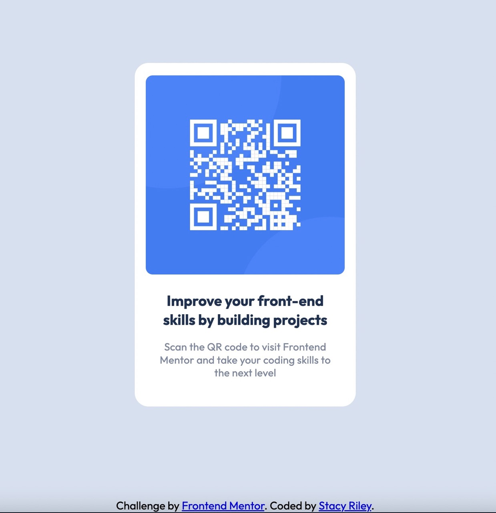

## Table of contents

  - [Overview](#overview)
  - [Screenshot](#screenshot)
  - [Links](#links)
  - [My process](#my-process)
  - [Built with](#built-with)
  - [What I learned](#what-i-learned)
  - [Author](#author)


## Overview

This is a mobile responsive QR code built using HTML and CSS Flexbox.

### Screenshot



### Links

- Solution URL: (https://github.com/Stacy-Riley/qr-code-component-main)
- Live Site URL: (https://stacy-riley.github.io/qr-code-component-main/)

## My process

I began by building the HTML structure, adding the image, and the written
content. Then in CSS I gave the divs their specific colors and size based on the design. I used Flexbox to center the app on the screen and also the 
contents within the app container. I added the font sizes, line spacing, and letter spacing.  Lastly, I adjusted the margins and padding  so the words and images matched the design mock up as close as possible. 

### Built with

- Semantic HTML5 markup
- CSS custom properties
- Flexbox
- Mobile-first workflow

### What I learned

I had difficulty placing the figure tag at the top edge so the spacing was 16px. I used a negative margin on the top to pull the image up and made adjustments to the lower elements to keep the right spacing. I am proud 
of the way it turned out.

```css
figure {
    height: 288px;
    width: 288px;
    margin: 0; 
    margin-top: -6px; 
}
```

## Author

- Website - [Stacy Riley](https://www.createdbystacy.com)
- Frontend Mentor - [@Stacy-Riley](https://www.frontendmentor.io/profile/Stacy-Riley)
- Twitter - [@AskStacyRiley](https://twitter.com/AskStacyRiley)


